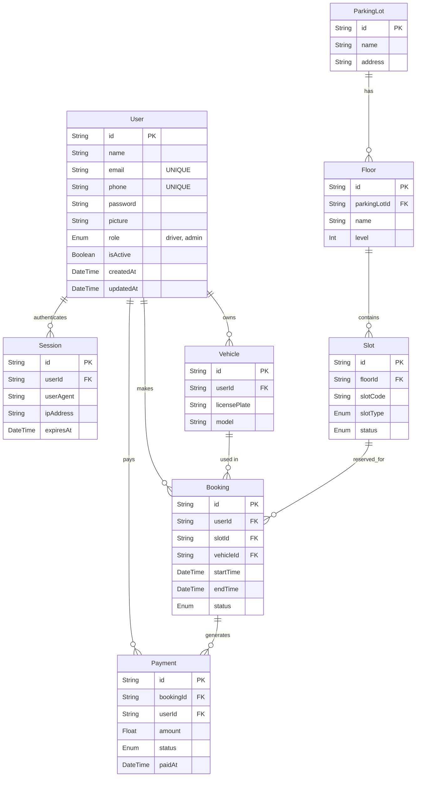
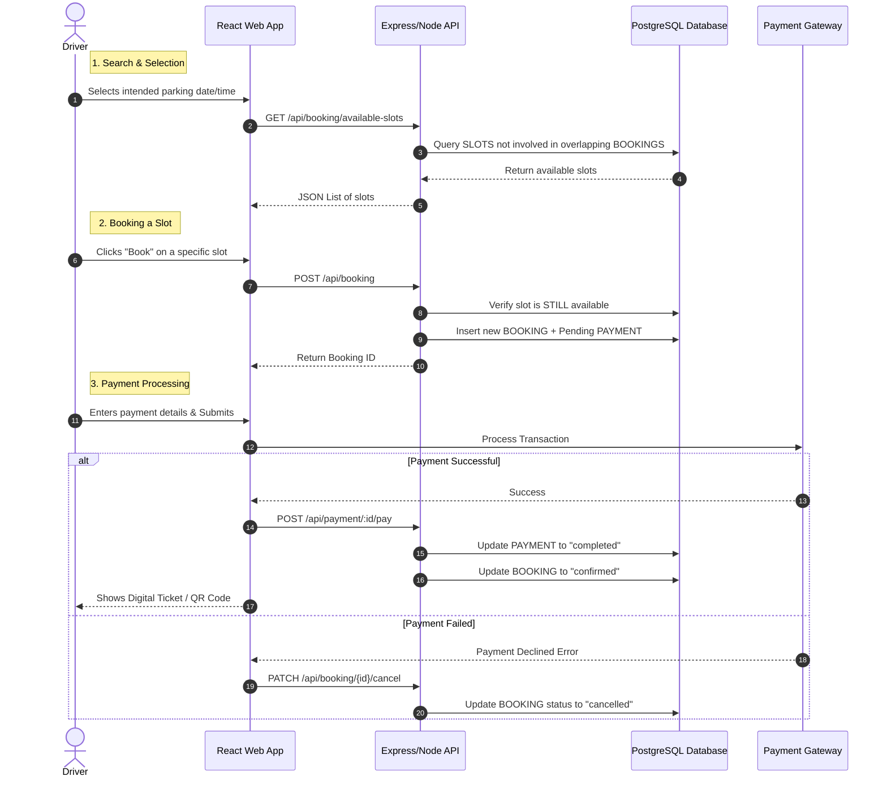
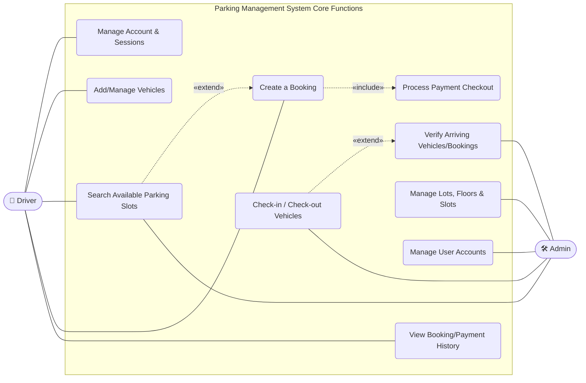

# Parking Management System

---

A full-stack enterprise parking management platform built with React, Express, TypeScript, and PostgreSQL. The system allows drivers to seamlessly browse available parking slots, securely book a space, and process simulated payments. On-site administrators can govern all physical infrastructure (Lots, Floors, Slots) and operationally track vehicular check-ins and check-outs in real-time.

---

## Table of Contents
- [Architecture](#architecture)
- [Tech Stack](#tech-stack)
- [Project Structure](#project-structure)
- [Database Design](#database-design)
- [Workflow](#workflow)
- [Use Cases](#use-cases)
- [Design Patterns](#design-patterns)
- [OOP Concepts](#oop-concepts)
- [SOLID Principles](#solid-principles)
- [API Endpoints](#api-endpoints)
- [Getting Started](#getting-started)

---

## Architecture
```text
+-------------------------------------------------------------+
|                     Frontend (React + Vite)                 |
|  +-----------+  +----------+  +--------------------------+  |
|  | Dashboard |  | Bookings |  |     Admin Dashboard      |  |
|  |           |  | & UI     |  | (Lots, Floors, Slots)    |  |
|  +-----------+  +----------+  +--------------------------+  |
|           AuthContext | TanStack Router | TailwindCSS       |
+---------------------------+---------------------------------+
                            | REST API (fetch)
                            v
+-------------------------------------------------------------+
|                Backend (Express + TypeScript)               |
|  +------------+  +----------------+  +------------------+   |
|  | Controllers|->|    Services    |->|  Repositories    |   |
|  | (HTTP)     |  | (Business)     |  | (Data Access)    |   |
|  +------------+  +----------------+  +------------------+   |
|                                                             |
|  BookingService --> Checks Overlaps + Creates Payments      |
|  AuthService --> JWT Session Tracking + Google OAuth        |
|  PaymentService --> Simulates Stripe Transactions           |
+---------------------------+---------------------------------+
                            | Prisma ORM
                            v
+-------------------------------------------------------------+
|                  PostgreSQL Database                        |
|  Users | Vehicles | Bookings | Payments | Lots | Sessions   |
+-------------------------------------------------------------+
```

---

## Tech Stack
| Layer | Technology |
|---|---|
| Frontend | React, TypeScript, Vite |
| Styling | TailwindCSS |
| State Management | React Context |
| Routing | TanStack Router |
| Backend | Node.js, Express, TypeScript |
| Database | PostgreSQL |
| ORM / Data Tool | Prisma |
| Authentication | JWT + Google OAuth2 + Custom Session Tracking |
| Containerization | Docker, Docker Compose |
| Monorepo Management | Turborepo, Bun |

---

## Project Structure

```text
parking-management-system/
|
|-- apps/
|   |-- api/                             # Backend API Server
|   |   |-- prisma/
|   |   |   |-- schema.prisma            # PostgreSQL Schema Definition
|   |   |   +-- seed.ts                  # Database seeder (generates slots/bookings)
|   |   +-- src/
|   |       |-- index.ts                 # Main server entrypoint
|   |       |-- lib/
|   |       |   +-- prisma.ts            # Prisma Singleton Client
|   |       |-- middleware/
|   |       |   +-- auth.middleware.ts   # JWT Guard (Chain of Responsibility)
|   |       |-- entities/                # Repositories & TypeScript Schemas
|   |       |   |-- user/
|   |       |   |-- booking/
|   |       |   +-- payment/             
|   |       +-- modules/                 # Business Logic & Controllers
|   |           |-- auth/                
|   |           |-- admin/               
|   |           |-- booking/             
|   |           +-- payment/             # Payment processing logic
|   |
|   +-- web/                             # Frontend React Application
|       +-- src/
|           |-- components/              # Reusable UI components
|           |-- contexts/                # AuthContext global state
|           |-- routes/                  # TanStack File-based routes
|           |-- lib/
|           |   +-- api.ts               # Backend API fetch wrappers
|           +-- styles.css               # Tailwind & Base styling
|
|-- packages/                            # Monorepo shared tools
|   |-- eslint-config/
|   +-- typescript-config/
|
|-- diagrams/                            # System Arch Diagrams (Mermaid)
|-- docs/                                # Documentation (SDLC, OOPS)
|-- scripts/
|   +-- setup.sh                         # Master environment builder
|-- compose.yml                          # Docker Compose configs
+-- package.json                         # Turborepo Workspace Config
```

---

<details>
<summary><strong>Click to expand -- Database Design (ERD)</strong></summary>
<br>

All tables and enums are hardcoded directly into the Postgres database.



```sql
CREATE TYPE Role  AS ENUM ('driver', 'admin');
CREATE TYPE SlotType  AS ENUM ('regular', 'compact', 'ev_charging', 'disabled');
CREATE TYPE SlotStatus  AS ENUM ('available', 'reserved', 'occupied', 'inactive');
CREATE TYPE BookingStatus  AS ENUM ('pending', 'confirmed', 'active', 'completed', 'cancelled', 'expired');
CREATE TYPE PaymentStatus  AS ENUM ('pending', 'completed', 'failed', 'refunded');
```

</details>

---

<details>
<summary><strong>Click to expand -- Sequence Diagrams (Workflow)</strong></summary>
<br>

### Booking & Payment Flow


</details>

---

<details>
<summary><strong>Click to expand -- Use Cases</strong></summary>
<br>



</details>

---

<details>
<summary><strong>Click to expand -- 4 Design Patterns with Code Examples</strong></summary>
<br>

### 1. Singleton Pattern
**Where:** `apps/api/src/lib/prisma.ts`
Ensures that the entire backend shares exactly one PostgreSQL connection pool without thrashing the database on every query.
```typescript
class Prisma {
  private static instance: PrismaClient;
  private constructor() {}

  public static getInstance(): PrismaClient {
    if (!this.instance) {
      this.instance = new PrismaClient({ adapter });
    }
    return this.instance;
  }
}
```

### 2. Repository Pattern
**Where:** `apps/api/src/entities/user/user.repository.ts`
Encapsulates all database interactions (`SELECT`, `INSERT`) away from the main business logic so services are oblivious to Prisma.
```typescript
export interface IUserRepository {
  getByEmail(email: string): Promise<DBUser | null>;
}
export class PrismaUserRepository implements IUserRepository {
  public async getByEmail(email: string) {
    return prisma.user.findUnique({ where: { email } });
  }
}
```

### 3. Dependency Injection (IoC Container)
**Where:** `apps/api/src/modules/auth/auth.container.ts`
Classes do not construct their own dependencies; they are built externally and injected via constructor arguments.
```typescript
export function createAuthModule() {
  const userRepository = new PrismaUserRepository(); 
  const authService = new AuthService(userRepository); // Injected
  return { authService };
}
```

### 4. Chain of Responsibility Pattern (Middleware)
**Where:** `apps/api/src/middleware/auth.middleware.ts`
Requests flow through a sequential chain of validators (JWT validation, Role checks) before hitting the Controller.
```typescript
const adminRouter = Router()
  .use(authenticate)          // First Link: Are they logged in?
  .use(requireAdmin)          // Second Link: Are they an admin?
  .get("/", adminController)  // Terminal Link: Execute business logic
```

</details>

---

<details>
<summary><strong>Click to expand -- OOP Concepts with Code Examples</strong></summary>
<br>

### 1. Encapsulation
Internal database logic is carefully hidden behind private access modifiers to prevent external tampering.
```typescript
// apps/api/src/lib/prisma.ts
class Prisma {
  private static instance: PrismaClient;  // Hidden state
  private constructor() {}                 // Blocked instantiation

  public static getInstance(): PrismaClient { ... } // Safe public accessor
}
```

### 2. Abstraction
Higher order services interact with simple interfaces, completely abstracting away the complex database query SQL beneath.
```typescript
// apps/api/src/entities/user/user.repository.ts
export interface IUserRepository {
  getByEmail(email: string): Promise<DBUser | null>; // Abstraction Contract
}
```

### 3. Inheritance
Subclasses inherit attributes and methods from built-in parent classes while extending custom functionality.
```typescript
// apps/api/src/utils/AppError.ts
class AppError extends Error {
  constructor(public statusCode: number, public message: string) {
    super(message); // Inherits standard Error stack traces
  }
}
```

### 4. Polymorphism
Different database engines or mocking systems can implement the same interface and be used interchangeably.
```typescript
// Both follow IUserRepository, responding to the exact same methods
const prismaRepo = new PrismaUserRepository();
const mockRepo = new MockTestUserRepository(); // Same interface, different behavior
```

</details>

---

<details>
<summary><strong>Click to expand -- 5 SOLID Principles</strong></summary>
<br>

| Principle | Proof of Concept in Codebase |
|---|---|
| **S** (Single Responsibility) | `user.repository.ts` strictly queries the DB. `auth.controller.ts` strictly fields HTTP requests. Neither class mixes responsibilities. |
| **O** (Open/Closed) | `IUserRepository` is closed to modification but open to extension (e.g., adding `MongoUserRepository` later). |
| **L** (Liskov Substitution) | Any class implementing `IUserRepository` can safely be substituted into the `AuthService` constructor without crashing the app. |
| **I** (Interface Segregation) | Interfaces are kept small (`IPaymentRepository`, `IVehicleRepository`) so services don't depend on methods they never use. |
| **D** (Dependency Inversion) | `AuthService` relies entirely on abstract interfaces injected via `auth.container.ts`, meaning the high-level logic never depends directly on low-level Prisma drivers. |

</details>

---

<details>
<summary><strong>Click to expand -- Core API Endpoints</strong></summary>
<br>

**Modules:**
- `GET /api/auth/me` - Fetch active session
- `POST /api/auth/login` - Authenticate & generate JWT
- `POST /api/booking` - Calculate slot overlaps and generate Booking + Payment
- `POST /api/payment/:id/pay` - Simulate executing payment against booking invoice
- `GET /api/vehicle/my-vehicles` - Fetch driver's car data
- `GET /api/admin/dashboard-stats` - Aggregate all lot financials and occupancy maths

</details>

---

## Getting Started

This project provides a fully automated setup script that installs dependencies, validates `.env` files, builds the Dockerized PostgreSQL database, and runs Prisma schema migrations.

**Prerequisites:**
- [Bun](https://bun.sh/)
- [Docker](https://docs.docker.com/get-docker/) & Docker Compose

### Start Development Server
```bash
# Clone the repository
git clone https://github.com/vikgenix/Parking_Management_System

# Automatically build DB, seed dummy data, and run frontend/backend
./scripts/setup.sh --dev
```

### Manual Controls
```bash
./scripts/setup.sh          # Just build infrastructure (No Web servers)
./scripts/setup.sh --prod   # Run optimized production mode
```
