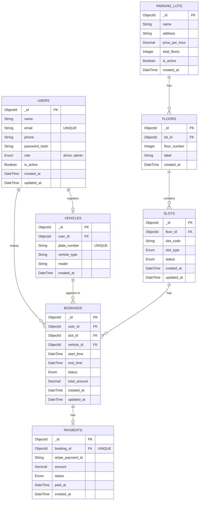

# Entity Relationship Diagram

```mermaid
erDiagram
    USERS ||--o{ BOOKINGS : makes
    USERS ||--o| VEHICLES : registers
    VEHICLES ||--o{ BOOKINGS : "appears in"
    PARKING_LOTS ||--o{ FLOORS : has
    FLOORS ||--o{ SLOTS : contains
    SLOTS ||--o{ BOOKINGS : has
    BOOKINGS ||--o| PAYMENTS : has

    USERS {
        ObjectId _id PK
        String name
        String email "UNIQUE"
        String phone
        String password_hash
        Enum role "driver, admin"
        Boolean is_active
        DateTime created_at
        DateTime updated_at
    }

    VEHICLES {
        ObjectId _id PK
        ObjectId user_id FK
        String plate_number "UNIQUE"
        String vehicle_type
        String model
        DateTime created_at
    }

    PARKING_LOTS {
        ObjectId _id PK
        String name
        String address
        Decimal price_per_hour
        Integer total_floors
        Boolean is_active
        DateTime created_at
    }

    FLOORS {
        ObjectId _id PK
        ObjectId lot_id FK
        Integer floor_number
        String label
        DateTime created_at
    }

    SLOTS {
        ObjectId _id PK
        ObjectId floor_id FK
        String slot_code
        Enum slot_type
        Enum status
        DateTime created_at
        DateTime updated_at
    }

    BOOKINGS {
        ObjectId _id PK
        ObjectId user_id FK
        ObjectId slot_id FK
        ObjectId vehicle_id FK
        DateTime start_time
        DateTime end_time
        Enum status
        Decimal total_amount
        DateTime created_at
        DateTime updated_at
    }

    PAYMENTS {
        ObjectId _id PK
        ObjectId booking_id FK "UNIQUE"
        String stripe_payment_id
        Decimal amount
        Enum status
        DateTime paid_at
        DateTime created_at
    }
```
