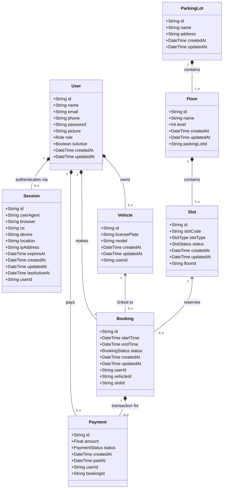

# Database Design — Parking Lot Management System

## Entities and Relationships

Here is the exact Mermaid Class Diagram modeled strictly 1:1 against the underlying PostgreSQL `schema.prisma` architecture. 

It strips away all outdated MongoDB/Beanie abstractions and strictly reflects the exact Typescript ORM types (like UUIDs, native enums, and foreign key relations).



---

## Enum Definitions

The ORM enforces strict enumeration constraints across the database schema:

```sql
CREATE TYPE Role           AS ENUM ('driver', 'admin');
CREATE TYPE SlotType       AS ENUM ('standard', 'compact', 'handicapped', 'ev_charging');
CREATE TYPE SlotStatus     AS ENUM ('available', 'reserved', 'occupied', 'inactive');
CREATE TYPE BookingStatus  AS ENUM ('pending', 'confirmed', 'active', 'completed', 'cancelled', 'expired');
CREATE TYPE PaymentStatus  AS ENUM ('pending', 'completed', 'failed', 'refunded');
```

